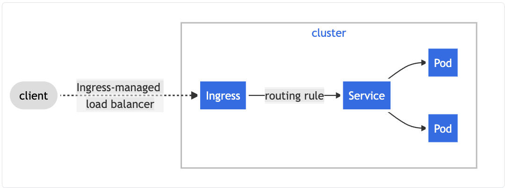
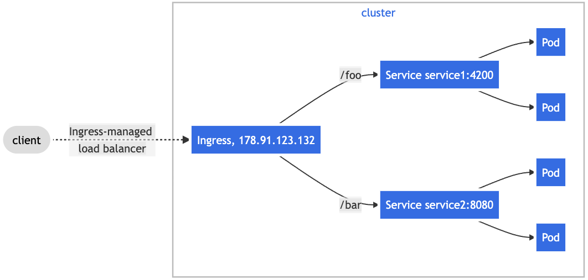

# Kubernetes Tutorial - Step 2 (pods, services & ingress)

In this part of the tutorial, we are going to deploy a simple Flask web application using Kubernetes. To do this, we will:
* Walk through creating a basic Pod
* Demonstrate how to configure a pod using environment variables
* Create another pod that attempts to download the web page from the Flask server within the Kubernetes cluster
* Create a service to connect to the pod using DNS
* Create an ingress to allow outside connections to the service and thus the pod

## Creating a basic pod

We're going to deploy the Blog application from [the flask tutorial](https://flask.palletsprojects.com/en/2.0.x/tutorial/index.html). To do this, we need to create a [Dockerfile](Dockerfile). In our example, we use an Ubuntu 20.04 base image and just follow the instructions from the Flask tutorial site.

The Dockerfile also includes directives to set the environment variable `FLASK_PORT` port to 5000; this environment variable is used in the `app.sh` command:
```
ENV	FLASK_PORT 5000
CMD	[ "/bin/sh", "-x", "/app/app.sh" ]
```
By using an environment variable, we can override the port specified used by the application.

### Pushing an image to Docker Register / Hub
Kubernetes can pull from man different Docker registeries; we'll use Docker Hub. You need to create a log at `hub.docker.com`. Record your credentials (username and password).

On the command line, execute
```
docker login
```
It will ask for your credentials; provide them. It should indicate successful login.

##### Pushing an image

You need to tag your image with you Docker hub username and a version and then push it to the hub.
For example, given:
```
> docker images | grep -i blog
blog      latest    1aaf9a329fa0        8 minutes ago       228MB
```
The "hash" (1aaf9a329fa0) is a unique identifier for a specific version of the blog container. Tagging the image provides ownership & version information. We tag this image using
```
> docker tag 1aaf9a329fa0 dirkcgrunwald/blog:v1
```
which indicates it will be owned by user "dirkcgrunwald" and be the "blog" image with version "v1". Then, push it to Docker Hub using
```
> docker push dirkcgrunwald/blog:v1
```
The `push` operation sends all of the "layers" of your contain to the Docker hub; we based our Dockerfile on the `python:3.8` base image and the existing layers don't need to be sent to the Docker hub because they are already there; only the additional layers (the specific application) are uploaded.

You'll need to modify the YAML files to specify your image or you can just use the provided image and then apply [01-blog.yaml](01-blog.yaml) to launch the pod:
```
> kubectl apply -f 01-blog.yaml
pod/blog-no-env created
```
While the pod will launch (use `kubectl describe pod blog-no-env` to confirm this), you won't be able to access the blog web page because we didn't "expose" the TCP port being used. Let's delete this pod and figure out how to configure the port
```
> kubectl delete pod blog-no-env
pod "blog-no-env" deleted
```

## Configuring a pod using environment variables

We could use the default TCP port (5000) or we can specific a specific TCP port in the pod definition. We modify the original YAML specification to set the port to `8888` and set an environment variable to communicate that to the `app.sh` applications:
```
  containers:
  - name: blog
    image: dirkcgrunwald/blog:latest
    ports:
      - containerPort: 8888
    env:
      - name: FLASK_PORT
        value: "8888"
``` 

Apply this Pod definition:
```
> kubectl apply -f 02-blog-env.yaml
pod/blog-env created
```
We can now directly access the Blog application by "port-forwarding" the pod pod to the local computer; this works even if the Blog application is running in a datacenter rather than on your laptop:
```
> kubectl apply -f 02-blog-env.yaml
pod/blog-env created
> kubectl port-forward pod/blog-env 7777:8888
Forwarding from 127.0.0.1:7777 -> 8888
Forwarding from [::1]:7777 -> 8888
```
If you then access [http://localhost:7777](http://localhost:7777) in a browser window, you'll see the blog application.

## Accessing the blog via a service

We used port-forwarding to access the blog, but we want other pods within our Kubernetes cluster to access it using a domain name. While pods have an IP address, and [it's possible to set a DNS hostname for the pod, the convention is to use a service](https://kubernetes.io/docs/concepts/services-networking/dns-pod-service/).

The [service definition 03-svc.yaml](03-svc.yaml) defines `blog-svc` which will "front" communication to the actual blog. The service uses port 9999 and forwards connections to `blog-svc:9999` to the `blog:8888`. The specific pods to which the service communicates are specified by "labels"
```
spec:
  selector:
    app: blog
```
The `app:blog` selector matches the `app:blog` label in [the blog pod definition](02-blog-env.yaml), and `blog-svc` will forward requests to any pod with that specific label. This becomes important when we want to crate a reliable or scalable service with multiple web servers, which we do in [section 4 of the tutorial](../04-scalability).

We create the service and check that it's connecting to our blog:
```
> kubectl describe svc/blog-svc
Name:              blog-svc
Namespace:         default
Labels:            <none>
Annotations:       <none>
Selector:          app=blog
Type:              ClusterIP
IP Family Policy:  SingleStack
IP Families:       IPv4
IP:                10.105.46.241
IPs:               10.105.46.241
Port:              blog  9999/TCP
TargetPort:        8888/TCP
Endpoints:         10.1.0.37:8888
Session Affinity:  None
Events:            <none>
```
In this example, the service responds on port 9999 and forwards communication to `8888/TCP` on the endpoint `10.1.0.37:8888` (the blog).

We can now access the blog through the service using port-forwarding:
```
> kubectl port-forward svc/blog-svc 7777:9999
Forwarding from 127.0.0.1:7777 -> 8888
Forwarding from [::1]:7777 -> 8888
```
If you visit `localhost:7777` in your browser, you'll see your blog. Your browser is accessing the forwarded port (7777) which is forwarded to the service (9999) which then connects to the blog (8888).

### Accessing the service using host names

Within the Kubernetes cluster, we can now access the blog by name. We [define a pod that uses `curl` to access `blog-svc` repeatedly](04-curl.yaml):
```
> kubectl apply -f 04-curl.yaml
pod/curl created
```
You can check the logs of the `curl` pod to see that it can successfully download the blog content:
```
> kubectl logs curl
  % Total    % Received % Xferd  Average Speed   Time    Time     Time  Current
                                 Dload  Upload   Total   Spent    Left  Speed
100   353  100   353    0     0  11031      0 --:--:-- --:--:-- --:--:-- 11031
<!doctype html>
....
```

## Deploy an `ingress` to publish our web server

At this point, we can access the blog within the Kubernetes cluster by name (*via* the service) and through port-forwarding. If we want the blog to be exposed to the outside work, [we need to deploy an `ingress`](https://kubernetes.io/docs/concepts/services-networking/ingress/):


Although an ingress is a standard Kubernetes network component, the specific implementation depends on the Kubernetes system you're using. This example uses the [kubernetes-ingress](https://github.com/nginxinc/kubernetes-ingress/blob/master/examples/complete-example/cafe-ingress.yaml) which works well for Docker Desktop.

You must install the ingress controller software using ( e.g. )
```
> kubectl apply -f https://raw.githubusercontent.com/kubernetes/ingress-nginx/controller-v1.0.4/deploy/static/provider/cloud/deploy.yaml
```
as shown at [the directions on deploying this for Docker Desktop](https://kubernetes.github.io/ingress-nginx/deploy/#docker-desktop). It takes a moment for the Ingress controller that you installed to actually be ready, so if the steps below don't work, wait a moment and try again.

The [ingress definition](05-ingress.yaml) specifies the forwarding `routing rule` that connects a specific URL to the the `blog-svc`. In order to connect the ingress definition to the specific ingress implementation, you need to specify an annotation:
```
  annotations:
    # use the shared ingress-nginx
    kubernetes.io/ingress.class: "nginx"
```
The [basic ingress configuration](https://kubernetes.github.io/ingress-nginx/user-guide/basic-usage/) in our [ingress definition](05-ingress.yaml) is pretty simple -- there is a single route (`/`) that is forwarded to the the `blog-svc` at port 9999.

You can also use different default routes to "fan-out" multiple services behind a single ingress:


This typically requires more complex ingress definitions. For example, we might want our blog to be access using `http://localhost/blog` rather than `http://localhost`. By default, the back-end pod web server will see the full URL and will need to handle the `/blog` portion. You can [specify an ingress that automatically strips this prefix](06-ingress-blog.yaml) using the [many annotations specific this to this particular Ingress implementation](https://kubernetes.github.io/ingress-nginx/user-guide/nginx-configuration/annotations/).

## Other ingress controllers

There are [many ingress implementations](https://kubernetes.io/docs/concepts/services-networking/ingress-controllers/) that may be specific to a particular cloud vendor or that have different options, such as TLS-termination (so your blog doesn't need to handle `HTTPS` connections), authentication and other features.